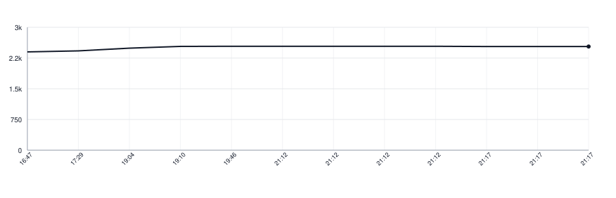

# readalign-kotlin

[](https://github.com/apakabarlabs/readalign-kotlin/actions/workflows/tests.yml)
[](https://apakabarlabs.github.io/readalign-kotlin/)

Lines a speech recogniser's output up against the text that was read, and says when each word of that text was spoken.

This is not transcription. The words are known in advance; the recogniser is only asked where they are, and it will get some of them wrong. So words are matched by how alike they look on paper rather than by equality, and a word left unmatched has its time interpolated from the words around it.

This is a Kotlin/JVM port of [readalign-swift](https://github.com/apakabarlabs/readalign-swift). The tuned numbers and the cases all three libraries are held to are synced from there with `make sync-yaml`, and a test holds the copies against that repository, so the ports cannot quietly drift apart.

## What it handles

- **A misheard word.** `stowage` comes back as `stoage`, `harbour` as `harbor`. Matched on similarity, so the word keeps its own time.
- **A word the recogniser wrote without its diacritics.** `čaša` comes back as `casa`, `łódź` as `lodz`. Likeness is measured with the marks lifted, or a short word in a language that uses them would not be found at all.
- **A word boundary in the wrong place.** `shouldst owe` comes back as `should stow`: the same sound, the gap moved one consonant cluster. Matched as a pair, on a stricter bar than a single word.
- **One written word heard as several**, and **several written words heard as one**.
- **A word nobody said.** A gap costs less than a bad pair, so a false start or an `um` is passed over instead of being pushed into a neighbouring word.
- **A run of words the recogniser dropped.** Their time is shared across the gap they left, by speech weight.

## Use

```kotlin
import fm.apakabar.readalign.RecognizedWord
import fm.apakabar.readalign.TranscriptAligner

val spans = TranscriptAligner.align(
    expected = listOf("From", "fairest", "creatures", "we", "desire", "increase"),
    heard = listOf(
        RecognizedWord("from", 0.00, 0.32),
        RecognizedWord("farest", 0.32, 0.81),
        RecognizedWord("creatures", 0.81, 1.44),
        RecognizedWord("we", 1.44, 1.60),
        RecognizedWord("desire", 1.60, 2.08),
        RecognizedWord("increase", 2.08, 2.72),
    ),
    duration = 3.0,
)

check(spans[1].start == 0.32)
check(spans[1].end == 0.81)
```

One span per expected word, in seconds, in reading order. What a word is on the page — which line it sits in, which of its letters get painted — stays with the caller.

A recording nothing was heard in comes back empty rather than with a span per word, because every span would be a guess dressed as a measurement:

```kotlin
import fm.apakabar.readalign.TranscriptAligner

check(
    TranscriptAligner.align(
        expected = listOf("From", "fairest"),
        heard = emptyList(),
        duration = 3.0,
    ).isEmpty(),
)
```

Words go in **as they are printed**, hyphens and elision marks and all: the parts of a hyphenated compound are counted before the marks are taken off, and a compound heard as three words cannot be matched without that count.

To ask only which word came back as which, without times:

```kotlin
import fm.apakabar.readalign.TranscriptAligner

val matches = TranscriptAligner.pair(
    expected = listOf("hearts", "shouldst", "owe"),
    heard = listOf("hearts", "should", "stow"),
    threshold = 0.6,
)

val movedBoundary = matches.any { it.expected == 1 until 3 && it.heard == 1 until 3 }
check(movedBoundary)
```

### Recogniser patches

`pair` and `align` both take an optional `equivalent`, called as `(written, heard, the written word before it)`. It is for pairs a particular recogniser reliably gets wrong in a way likeness cannot carry, and it is asked with either side joined up as well. Homophones are the common case: read aloud, `queue` comes back written `cue` and `rustle` comes back `Russell`, and those readings are good however little the spellings share.

```kotlin
import fm.apakabar.readalign.TranscriptAligner

val matches = TranscriptAligner.pair(
    expected = listOf("the", "heir"),
    heard = listOf("the", "air"),
    threshold = 0.6,
    equivalent = { written, heard, _ -> written == "heir" && heard == "air" },
)

check(matches.any { it.expected == 1 until 2 })
```

### Holding a word open through the silence after it

The one part that needs the recording. A recogniser marks where a word stops being audible, not where the voice has finished with it, so a passage played to the mark stops a hair short of itself. Give it the samples and the marks come back carried to the quiet:

```kotlin
import fm.apakabar.readalign.SilenceHold
import fm.apakabar.readalign.WordSpan

val samples =
    (FloatArray(1500) { 0.5f } + FloatArray(1000) { 0.0f } +
        FloatArray(2000) { 0.5f } + FloatArray(1000) { 0.0f })

val spans = SilenceHold.held(
    listOf(WordSpan(0.05, 0.10)),
    samples = samples,
    sampleRate = 10000.0,
)

check(spans[0].end > 0.10)
```

### Other languages

Time is shared out among unmatched words by a `SpeechWeighting`. `EnglishSyllableWeighting` counts vowel groups less a silent final `e`; `EvenWeighting` gives every word the same share, which is what a language it cannot count should use until someone writes one for it. Anything implementing the interface will do.

A weight that is not a finite number is read as one rather than trusted: a comparison against such a value is false whichever way round it is put, and it would otherwise travel through into every span.

```kotlin
import fm.apakabar.readalign.EvenWeighting
import fm.apakabar.readalign.RecognizedWord
import fm.apakabar.readalign.TranscriptAligner

val spans = TranscriptAligner.align(
    expected = listOf("kuća", "čaša", "šuma"),
    heard = listOf(
        RecognizedWord("kuca", 0.0, 0.8),
        RecognizedWord("casa", 1.0, 1.8),
        RecognizedWord("suma", 2.0, 2.8),
    ),
    duration = 4.0,
    weighting = EvenWeighting(),
)

check(spans[1].start == 1.0)
```

## Install

Not on Maven Central yet, so a consumer takes it from the tag through [JitPack](https://jitpack.io):

```kotlin
repositories {
    maven("https://jitpack.io")
}

dependencies {
    implementation("com.github.apakabarlabs:readalign-kotlin:v0.13.0")
}
```

The API is not settled before 1.0 and may change between minor versions.

## Documentation

The [Dokka API reference](https://apakabarlabs.github.io/readalign-kotlin/) is generated from the public Kotlin API and deployed by GitHub Actions.

## Develop

```bash
make test
make lint
make docs
make build
make sync-yaml   # after the rules or the cases change in readalign-swift
```

Releases are published by the [Release workflow](https://github.com/apakabarlabs/readalign-kotlin/actions/workflows/release.yml).

## Lines of Code

<picture>
  <source media="(prefers-color-scheme: dark)" srcset=".github/loc-history-dark.svg">
  <source media="(prefers-color-scheme: light)" srcset=".github/loc-history-light.svg">
  
</picture>
